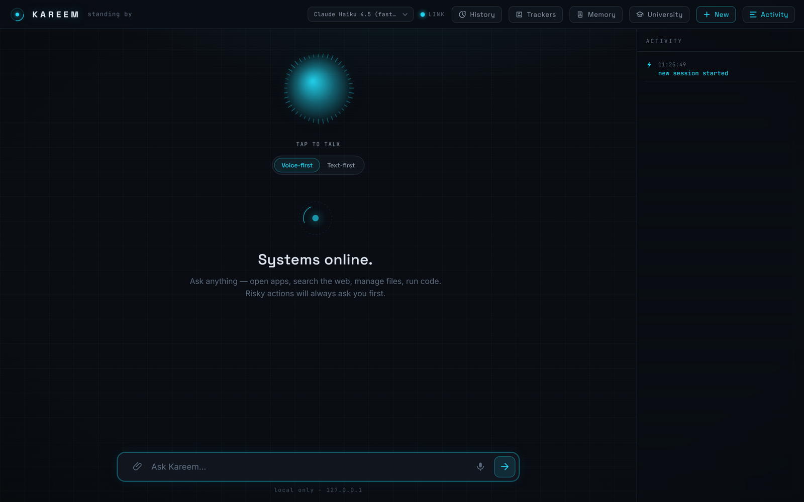
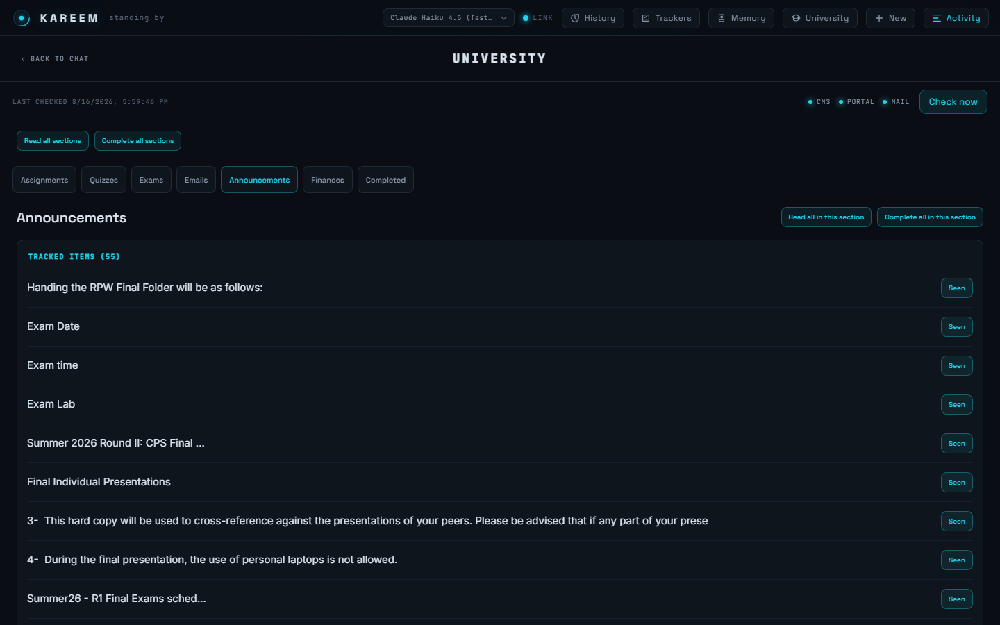
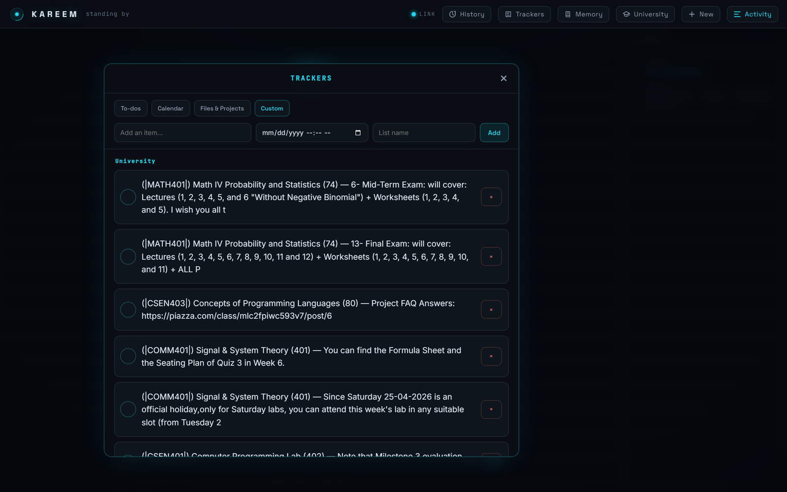
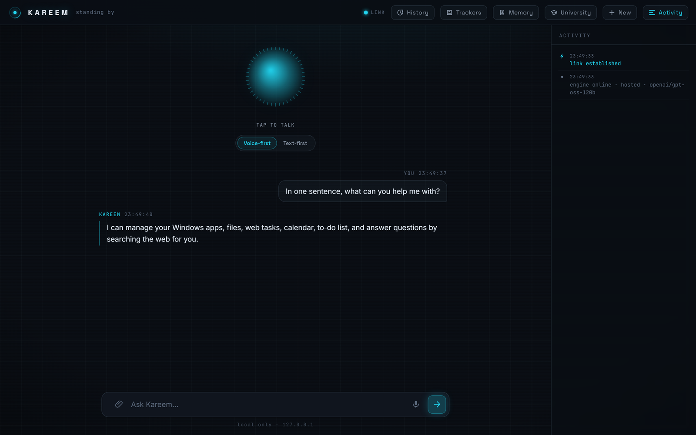
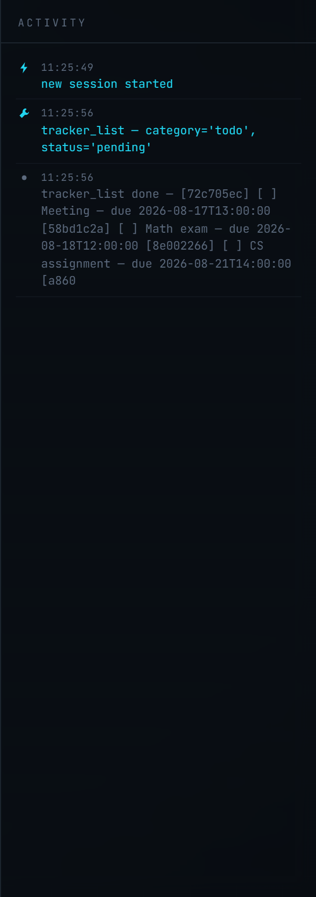

# Kareem — your personal desktop assistant



Kareem is a voice + text assistant that runs on your own PC. By default it
thinks with a **free hosted cloud model** (fast — it runs on the provider's
GPU, not your laptop). Two other brains are one config line away: a fully
**offline local model** via Ollama (private, free, slower) and the **Claude
API** (smartest, paid).

> **Requires Windows.** Desktop/app control, the background tray service, and
> several voice components use Windows-specific APIs (PowerShell, Windows UI
> Automation, Windows toast notifications). Kareem has only been built and
> tested on Windows — treat it as Windows-only for now.

This README is written for someone who is **not a developer**. Follow the
steps in order and copy/paste the commands exactly.

---

## What Kareem can do

| Ask it to… | What happens |
|---|---|
| "Open Chrome" / "open notepad" | The app opens (no confirmation needed — harmless) |
| "What windows are open?" / "focus the Excel window" | Lists / switches windows |
| "Search the web for …" | Searches, reads results, summarizes for you |
| "What's in my Downloads folder?" / "find all PDFs in …" / "read that file" | Lists, finds, reads files (read-only, no confirmation) |
| "Move/rename/delete this file" | **Asks you to confirm first**, then does it |
| "Run a command / run some Python to …" | Shows you the exact command/code and **asks you to confirm first** |
| "Ask Claude Code to fix/build/change …" | Delegates the coding task to Claude Code and **asks you to confirm first** |
| "Shut down the computer" | **Asks you to confirm first** |

**The safety rule:** anything that changes or deletes something on your PC —
moving/deleting files, shell commands, running code, shutdown/restart — is
described to you exactly and waits for your yes (typed `y`, or spoken "yes"
in voice mode). If you say anything else, nothing happens. Every action is
logged to `kareem.log` in this folder.

### Optional Claude Code delegation

Kareem can hand a coding task to the Claude Code CLI. This optional capability
needs `claude` installed and authenticated; `claude --help` should work in a
terminal. If the CLI is absent, the tool simply returns a plain-English
"not installed" message instead of crashing. Delegation can edit files and run
commands, so Kareem always asks for confirmation first, just like its other
risky actions. Its project folder and permission mode can be changed in
`kareem/config.py`.

### Google Calendar (optional)

Kareem can create, list, find, and delete events on your real Google Calendar.
Deleting an event always asks for confirmation. To connect it:

1. Create or select a project in the Google Cloud Console.
2. Enable the **Google Calendar API** for that project.
3. Configure the OAuth consent screen and add yourself as a test user.
4. Create an OAuth client with application type **Desktop app**.
5. Download the client file as `credentials.json` into this project folder,
   beside `main.py`.

The first calendar command opens your browser for one-time Google consent.
Kareem then stores `token.json` locally and refreshes access silently. Both
credential files are ignored by Git.

### GUC integration (optional, institution-specific)

Kareem can automatically check CMS, the Student Portal, and Mail/OWA for new
assignments, quizzes, exams, and announcements — but only for the **German
University in Cairo (GUC)**. This was built for one specific university's
systems. If you don't attend GUC, there's nothing to set up and nothing
runs: leave `GUC_USERNAME`/`GUC_PASSWORD` unset in `.env` and every
GUC-related tool and background check is simply never loaded.

If you do attend GUC and want to use it, set `GUC_USERNAME`/`GUC_PASSWORD`
in `.env` to your normal GUC login. Sessions on GUC's systems are
short-lived, so Kareem logs in fresh each check cycle rather than storing
one; credentials are read from `.env` only, never logged or written to
session transcripts. A background check runs every
`GUC_CHECK_INTERVAL_MINUTES` (`kareem/config.py`, default 45) with
randomized jitter and a hard cooldown between logins to the same system,
specifically to avoid tripping GUC's own account monitoring or Exchange's
session limits — but automated logins to a real institution's systems are
still something to use at your own judgment, not something Kareem can
guarantee is risk-free for your account.


*Everything GUC turns up gets sorted into tabs, with per-item read/completed tracking and one-click "mark all" actions.*

### Trackers (to-dos, deadlines, custom lists)

Open the **Trackers** panel (button in the top bar) to see everything Kareem
is keeping track of for you — plain to-dos, calendar-linked reminders, and
custom lists. GUC deadlines land here too, tagged by course, alongside
whatever else you ask Kareem to track. Add, complete, or delete items from
the panel, or just ask Kareem in chat ("add a to-do to…", "what's on my
plate this week?").


*A populated custom list — course deadlines and announcements Kareem pulled in automatically.*

## Three ways to talk to it

1. **The website (the main way)** — running Kareem (`run_kareem`, see
   [Part 2](#part-2--how-to-run-it-every-day) below) also starts a local web
   interface at **http://127.0.0.1:8000**. Saying **"hey jarvis"** or pressing
   **Ctrl+Alt+J** opens/focuses it in your browser. It has streaming replies,
   a live feed of what Kareem is doing, Confirm/Cancel buttons for risky
   actions, and a mic button (browser voice — best in Chrome/Edge; replies to
   spoken messages are read aloud). Only this PC can reach it — it is never
   exposed to the network.
2. **Type** in the console window (works exactly as before).
3. **Voice in the console** — set `WAKE_OPENS_WEB = False` in
   `kareem/config.py` to make the wake word/hotkey talk out loud like it used
   to, instead of opening the website.

All three share ONE conversation — you can mix them freely.


*The website: the orb, a real conversation, and a live feed of what Kareem is doing.*


*Every tool call is traced live in that feed — here, `tracker_list` fetching a to-do.*

---

## Part 1 — One-time setup

1. **Python 3.11+** — from https://python.org/downloads/ — **tick "Add
   Python to PATH"** during install. Check: `python --version`
2. **Python packages** — in this folder run: `pip install -r requirements.txt`
3. **Playwright's browser** (needed for browser control and the GUC
   integration) — run: `playwright install chromium`
4. **ffmpeg** (voice only) — run `winget install ffmpeg`, then reopen the terminal.
5. **A free Groq key**, for the default hosted brain (more on this in
   [The fast free brain](#the-fast-free-brain-the-default) below) — sign up
   at https://console.groq.com (free, no card), copy `.env.example` to `.env`
   in this folder, and paste the key in as `HOSTED_API_KEY`.
6. Check everything: `run_kareem --check` (or `python main.py --check`) —
   fix anything marked `[FAIL]` using the hint it prints.

Prefer everything to stay fully offline and private instead? Skip step 5 —
see [Switching back to fully-local](#switching-back-to-fully-local-offline-private),
no Groq key needed at all that way. (Even with the hosted brain, installing
[Ollama](https://ollama.com) is worthwhile as a fallback: Kareem automatically
uses it if the hosted brain is ever unreachable — entirely optional.)

### Kokoro voice (the default)

Kokoro is Kareem's natural, offline speaking voice. Install its two Python
packages (the normal full install command in step 4 above also does this):
```
pip install kokoro-onnx soundfile
```

Download these two files:

- https://github.com/thewh1teagle/kokoro-onnx/releases/download/model-files-v1.0/kokoro-v1.0.onnx
- https://github.com/thewh1teagle/kokoro-onnx/releases/download/model-files-v1.0/voices-v1.0.bin

Create the folder `kareem/voice/models/kokoro/` and put both files inside it.
To choose a different voice, change `TTS_VOICE` in `kareem/config.py`; the
comments there list a few British and American choices. If Kokoro cannot
start, Kareem automatically tries Piper and then the basic Windows voice.

### Piper voice (fallback option)

Piper remains a faster offline fallback. To install one of its voices, run
this once in this folder:
```
python -m piper.download_voices en_US-lessac-medium --data-dir kareem/voice/models
```
Restart Kareem and set `TTS_ENGINE = "piper"` in `kareem/config.py` if you
want to use it instead of Kokoro.

---

## Part 2 — How to run it every day

1. Open a terminal in this folder (the one containing `main.py`).
   Tip: in File Explorer, right-click inside the folder → "Open in Terminal".
2. Run:
   ```
   run_kareem
   ```
   (double-click `run_kareem.bat`, or type `run_kareem` in the terminal).
   This always uses the same Python that has Kareem's packages installed —
   handy if your PC has more than one. Plain `python main.py` also works, as
   long as it's the same interpreter you ran `pip install` with.
3. Talk (say "hey jarvis" or press Ctrl+Alt+J) or type. Type `exit` to quit.

Text-only mode (skip all voice features): `run_kareem --no-voice`

If anything seems broken, run `run_kareem --check` first — it reports what's
wrong in plain English.

Using the offline Ollama brain (`BRAIN = "ollama"`)? Make sure Ollama is
running first — it starts with Windows by default; if unsure, just open the
Ollama app once.

---

### Running Kareem in the background (no console window)

Run this once from the Kareem folder to create a **Kareem** shortcut on your
Desktop:

```
python scripts/create_desktop_shortcut.py
```

Double-click that shortcut whenever you want to start Kareem silently. A small
cyan tray icon shows that Kareem is running; right-click it to **Open Web UI**
or **Quit**.

Because this keeps Kareem running in the background, the **"hey jarvis"** wake
word now always has something listening — if it seemed not to work before,
that was because nothing was running.

To make Kareem start automatically each time you sign in to Windows, run:

```
python scripts/create_desktop_shortcut.py --autostart
```

To turn automatic startup off again, run:

```
python scripts/create_desktop_shortcut.py --remove-autostart
```

### Simple mode (one sitting, browser-only)

Prefer starting Kareem only when you need it, with no tray icon to remember
to quit later? Run:

```
python scripts/create_desktop_shortcut.py --simple
```

This creates a separate, distinctly-named **Kareem (Simple Mode)** Desktop
shortcut. Double-click it and Kareem opens straight in your browser; close
that browser tab and Kareem shuts itself down. (A short grace period tells a
page refresh apart from an actual close, so refreshing doesn't quit it.)

---

## Settings you can change

Open `kareem/config.py` in Notepad — every setting is explained in comments:

- `BRAIN` — `"hosted"` (free cloud, default), `"ollama"` (free, local,
  offline), or `"claude"` (paid API)
- `OLLAMA_MODEL` — which local model to use
- `VOICE_ENABLED` — master switch for all voice features
- `TTS_ENGINE`, `TTS_VOICE`, `TTS_SPEED` — speaking voice and speed
- `WAKE_WORD_ENABLED` — turn "hey jarvis" listening on/off
- `HOTKEY` — the push-to-talk key combo
- `STT_MODEL` — speech recognition size: `"base"` (fast) or `"small"` (more accurate)

What Kareem treats as "risky" (= asks before doing) is listed in
`kareem/safety.py` (`RISKY_ACTIONS`) and is meant to be edited by you.

---

## The fast free brain (the default)

The default brain is a free hosted model on **Groq**
(`openai/gpt-oss-120b`) — Groq's chips answer with sub-second first-token
latency, so replies start almost instantly and Kareem begins **speaking the
first sentence while the rest is still being written** (streaming; turn off
with `STREAMING = False` in config). One-time setup:

1. Sign up at **https://console.groq.com** (free, no credit card) and create
   an API key.
2. Copy `.env.example` to a file named `.env` in this folder (if it isn't
   there already) and paste your key:
   ```
   HOSTED_API_KEY=gsk_...your-key...
   ```
3. Run `run_kareem --check` — it should say the key was found.

**How the model id works:** in `kareem/config.py`, `HOSTED_BASE_URL` picks
the provider and `HOSTED_MODEL` picks the model on that provider. The config
comments list ready-made pairs: other Groq models, free OpenRouter models,
the Nous Research portal for real Hermes 4, and NVIDIA NIM. Changing
providers is always just those two lines plus the matching key in `.env`.

**Free-tier limits:** Groq allows roughly 30 requests/minute per model plus
daily token caps — plenty for personal use. If you ever hit them, Kareem
waits and retries automatically; if the endpoint stays unreachable and
Ollama is running locally, it answers with the local model instead and
prints a note saying so (`HOSTED_FALLBACK_TO_OLLAMA` in config turns this
off).

**Privacy note:** a few things Kareem does leave your PC, depending on what
you use:
- **The hosted brain** (default): the *text* of your conversation is sent to
  the provider's servers (Groq, or whichever `HOSTED_BASE_URL` you configure).
- **The vision-click fallback** (`kareem/tools/vision.py`, last resort for
  clicking something on screen): a screenshot of your primary monitor is sent
  to Groq's vision model.
- **Web search** (`web_search`/`fetch_page`): your query, and any page URL
  you ask Kareem to fetch, goes to DuckDuckGo / that page's own server.
- **Google Calendar** (if connected): event details you create/read go to
  Google, under the OAuth consent you granted.
- Everything else — files, screen contents outside of vision-click, app
  control, the GUC integration — stays local unless you explicitly ask
  Kareem to send it somewhere.

For anything sensitive, switch to the fully-local Ollama brain below (no
conversation text leaves your PC), and avoid the vision-click fallback and
web tools for that session.

**Your data:** everything Kareem remembers is stored locally in this folder,
in plain (unencrypted) files — no cloud sync, no account system. What's
stored, where, and how to clear it:

| What | Where | To clear it |
|---|---|---|
| Full conversation transcripts (everything said, including tool results) | `sessions/` | Delete individual sessions from the web UI's History panel, or delete the whole folder |
| Durable remembered facts ("remember that…") | `data/memory.json` | Delete facts from the Memory panel, or delete the file |
| To-dos/reminders/tracker items | `data/trackers.json` | Delete items from the Trackers panel, or delete the file |
| GUC check history/login state (only if GUC is configured) | `data/guc_check_history.json`, `data/guc_login_state.json` | Delete the files |
| Every action Kareem takes (for debugging) | `kareem.log` | Delete the file |
| Google Calendar authorization | `token.json` | Delete the file — Kareem asks you to reconnect next time it's needed |

Kareem doesn't automatically expire or delete any of this — it's yours to
manage. Any of these files/folders are recreated automatically the next
time they're needed, so deleting them is always safe.

---

## Switching back to fully-local (offline, private)

1. Install [Ollama](https://ollama.com), then run:
   ```
   ollama pull qwen2.5:3b
   ```
   (a one-time download; matches the default `OLLAMA_MODEL` below). *Less
   than 16 GB RAM? Use `ollama pull llama3.2:3b` instead and set
   `OLLAMA_MODEL = "llama3.2:3b"` in `kareem/config.py`.*
2. Open `kareem/config.py` and change one line:
   ```python
   BRAIN = "ollama"
   ```

That's the whole switch — same tools, same safety gate, no internet needed,
nothing leaves your PC. Change it back to `"hosted"` anytime.

---

## Switching to Claude (optional, paid)

1. Copy `.env.example` to a new file named `.env` in this folder.
2. Get an API key from https://console.anthropic.com/settings/keys and put it
   in `.env`: `CLAUDE_API_KEY=sk-ant-…`
3. In `kareem/config.py` set `BRAIN = "claude"`.
4. Run `run_kareem` (or `python main.py`) as usual.

Everything else — tools, safety confirmations, voice — works identically.
Switch back anytime with `BRAIN = "hosted"` (the default, also free) or
`BRAIN = "ollama"` (fully offline, also free). Claude is the only one of the
three that bills per use, through your Anthropic account. Your key lives
only in `.env`, which is never committed or shared.

---

## Project layout

```
Kareem/
  main.py                # entrypoint — run this
  requirements.txt       # Python packages
  .env.example           # copy to .env and add a key (Groq by default,
                          # or Anthropic's if you switch to the Claude brain)
  kareem.log             # every action Kareem takes is recorded here
  kareem/
    config.py            # <-- the file you edit to change settings
    brain.py             # Ollama / Claude connection + tool-calling loop
    agent.py             # chat loop + tool dispatch
    safety.py            # the confirmation gate + action log
    voice/               # tts, stt, wake word, mic recording, controller
    tools/               # apps, web, files, system commands, code execution
    web/                 # the browser interface (127.0.0.1:8000)
      server.py          # FastAPI + WebSocket wrapper around the same engine
      static/            # the page itself — plain index.html / styles.css /
                         # app.js, editable by hand, no build tools
```

---

## Troubleshooting

- **"python is not recognized"** — Python isn't on PATH. Reinstall with
  "Add Python to PATH" ticked, or reopen the terminal.
- **"Kareem can't start: its dependencies aren't installed in THIS Python"**
  — your PC has more than one Python installed, and this one doesn't have
  Kareem's packages. Run `run_kareem.bat` (or type `run_kareem` in this
  folder) instead of a bare `python main.py` — it always finds the right
  one. `run_kareem --check` gives the full diagnostic.

**Using the default hosted brain (Groq):**
- **"No HOSTED_API_KEY in .env"** — copy `.env.example` to `.env` and paste
  in a key from https://console.groq.com (free, no card).
- **Kareem says the hosted brain is unavailable and falls back** — Groq is
  rate-limited or briefly unreachable; Kareem retries automatically and, if
  Ollama is installed and running, answers with that instead in the
  meantime. If it persists, check your usage/limits at
  https://console.groq.com.

**Voice (any brain):**
- **Wake word doesn't trigger** — speak clearly, close to the mic; check
  Windows Settings → Privacy → Microphone allows desktop apps. If it never
  works on your hardware, use the hotkey — same result. You can also raise
  or lower `THRESHOLD` in `kareem/voice/wakeword.py`.
- **Hotkey doesn't work** — some setups need the terminal to run as
  administrator for global hotkeys; the wake word still works without it.
- **It talks over itself / echoes** — use headphones, or turn off the wake
  word and use the hotkey.
- **First voice command is slow** — the speech-recognition model loads on
  first use; later commands are fast.

**If you've switched to the offline Ollama brain (`BRAIN = "ollama"`):**
- **"Couldn't reach Ollama"** — open the Ollama app so its background
  service starts, then try again.
- **"Model not downloaded"** — run `ollama pull qwen2.5:3b` (or whatever
  `OLLAMA_MODEL` is set to in `kareem/config.py`).
- **Replies are slow** — normal for a local model on CPU; first reply after
  starting is slowest. A smaller model (`llama3.2:3b`) is faster.

A note on the design: there is deliberately **no way to turn off
confirmations** for destructive actions. The model can never delete, move,
run, or shut down anything without you saying yes first.
